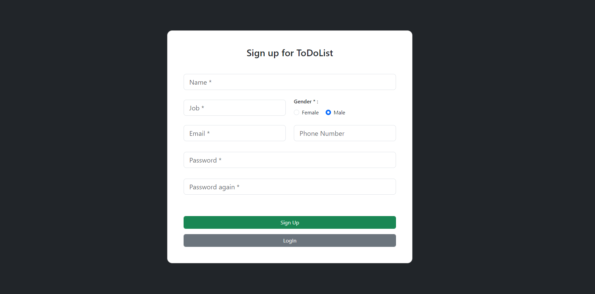
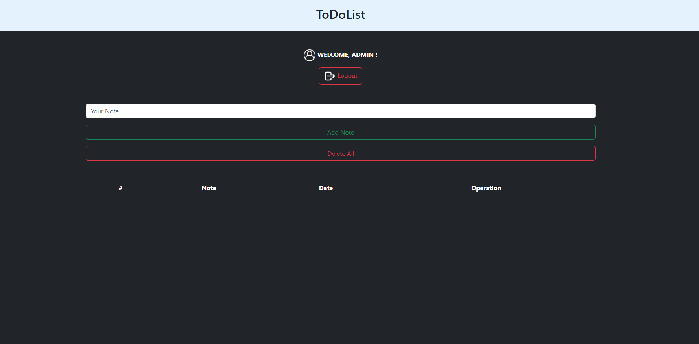
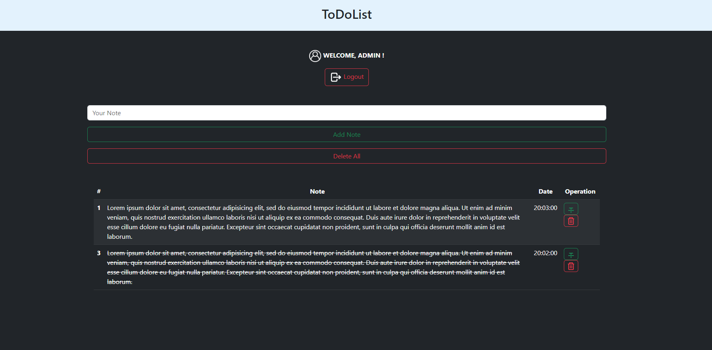

# ToDoList---PHP

In this project, I wanted to make a project where you can take notes using MYSQL and PHP.

<h2>--> You need to be logged in for the project.</h2>

<h2>--> If you do not have an account, you can create a new account instantly.</h2>

<h2>--> If your login process is successful, the system will direct you to the homepage within 3 seconds.</h2>

<h2>--> After logging in, there is a field where you can enter your note and there are 3 buttons available to you.</h2>

- <h3>Logout: allows you to log out securely.</h3>
- <h3>Add note: It is used to save the note you have entered in the note field.</h3>
- <h3>Delete All: this button deletes all your saved notes. (Be careful, this action cannot be undone.)</h3>
- <h3>The green button in the note is designed for you to use when you complete your note.</h3>
- <h3>The red button in the note is designed to delete that note. (Be careful, this action cannot be undone.)</h3>

<b> <h2>An example of this project <a href="https://project.4lphasoftware.com/todolist">From here</a> you can review. </h2></b>

<h1>For the installation of the project;</h1>

- <h3>Put the given files in the localhost folder.</h3>
- <h3>Go to phpmyadmin page.</h3>
- <h3>Create a new database named "todolist" here.</h3>
- <h3>Drag and drop the "todolist.sql" file given in the project files to the database you created.</h3>
- <h3>Navigate to the project's location from your localhost page and it's ready to go.</h3>
