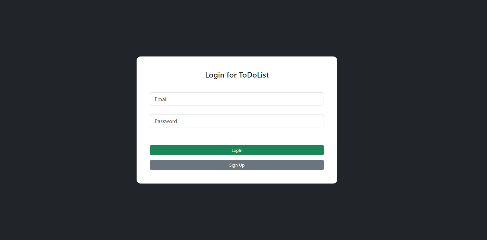
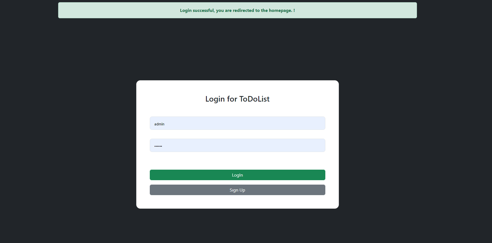

# ToDoList---PHP

In this project, I wanted to make a project where you can take notes using MYSQL and PHP.

--> You need to be logged in for the project.

--> If you do not have an account, you can create a new account instantly.

--> If your login process is successful, the system will direct you to the homepage within 3 seconds.

--> After logging in, there is a field where you can enter your note and there are 3 buttons available to you.

- Logout: allows you to log out securely.
- Add note: It is used to save the note you have entered in the note field.
- Delete All: this button deletes all your saved notes. (Be careful, this action cannot be undone.)
- The green button in the note is designed for you to use when you complete your note.
- The red button in the note is designed to delete that note. (Be careful, this action cannot be undone.)

